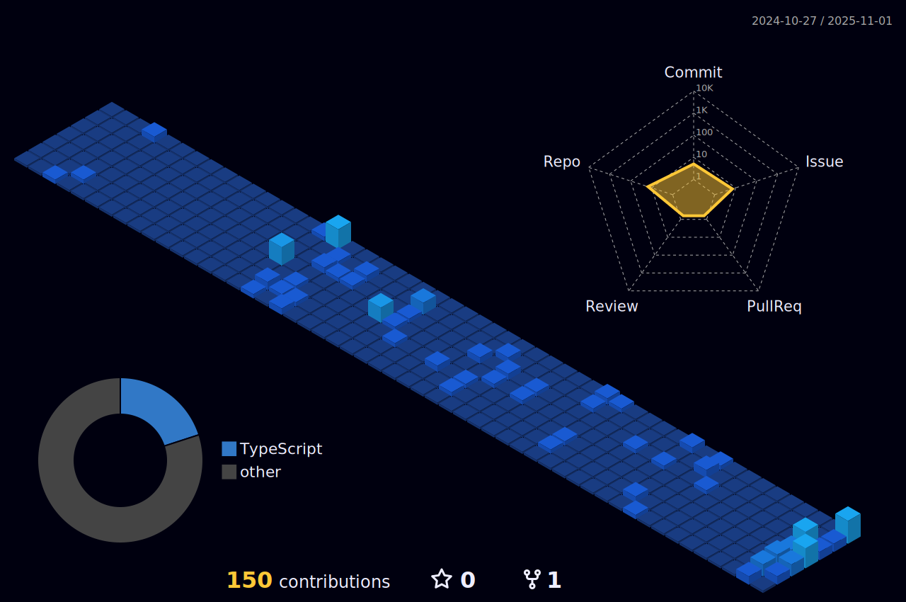

_Nothing could affect you, Recognize yourself, and do it!_

<!-- 
 -->

<!--  -->

_# Blog posts_
<!-- BLOG-POST-LIST:START -->
_- [The design of GC](https://liangye-xo.xyz/?p=752)_
 
_- [spring-statemachine](https://liangye-xo.xyz/?p=750)_
 
_- [spring-retry](https://liangye-xo.xyz/?p=747)_
 
_- [hippo4j](https://liangye-xo.xyz/?p=743)_
<!-- BLOG-POST-LIST:END -->

<!--  -->

